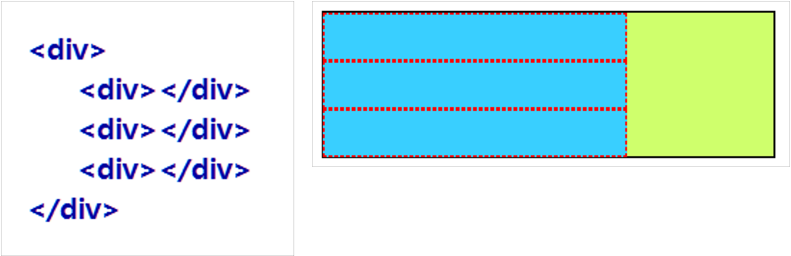
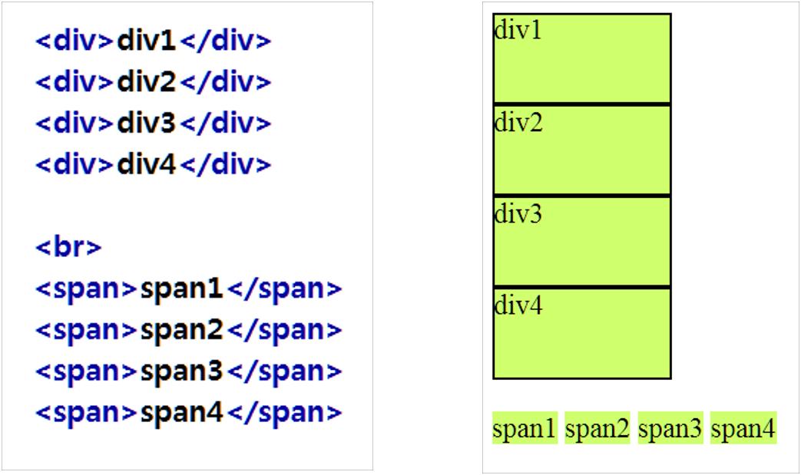
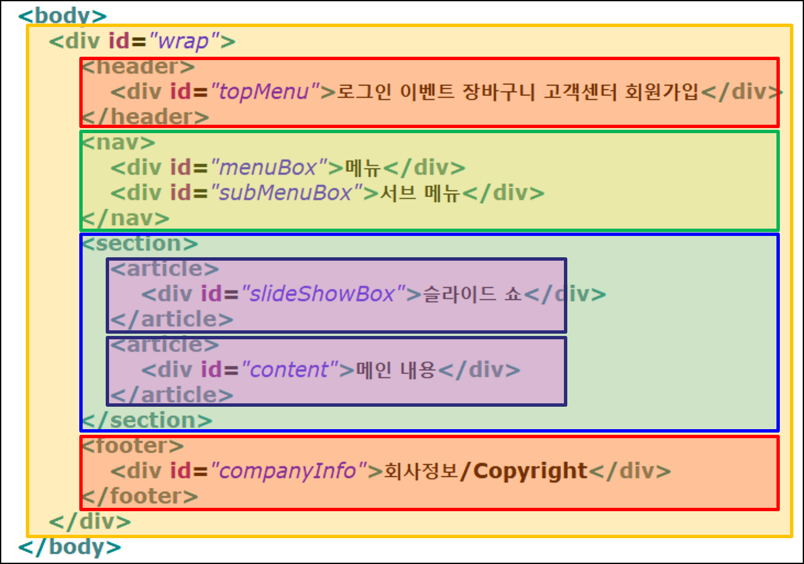

# TIL_Day_21

> 2022년 06월 13일

## 웹/앱 기반의 반응형 UI/UX 개발

### 기본 용어

- HTTP : Hyper Text Transfer Protocol
  - W3 상에서 정보를 주고 받을 수 있는 프로토콜
- Protocol
  - 통신 규약
- 웹 표준 단체
  - The World Wide Web Consortium
- Web Browser
  - 웹 서버와 통신하여 HTML 문서나 파일, 이미지 등의 리소스를 출력하는 GUI 기반의 소프트웨어
  - 클라이언트 측 Component / HTTP 프로토콜 기반

### 웹의 동작 구조


### 개발의 종류

### Front-End 개발

- 웹 사이트 중 사용자와 직접 상호작용하는 부분 개발
- 사용자 인터페이스(UI)와 사용자 경험(UX)을 만드는데 초점을 맞추고 있음
- 입력 확면, 드롭다운 메뉴, 레이아웃, 폰트, 컬러 등
- 언어 : HTML, CSS, JavaScript
- 자바스크립트 라이브러리 : jQuery, React 등
- 프레임워크 : Bootstrap, Angular 등

#### Back-End 개발

- 서버 측 개발 분야
- 프론트 엔드에 있는 사용자의 요구 처리
- 서버, 응용 프로그램, 데이터베이스로 구성
- 시스템 컴퓨넌트 작업, API 작성, 라이브러리 생성, 데이터베이스 관련 작업 등 다양한 작업 처리
- 언어 : Java(JSP/Servlet), PHP, .Net, Python
- 자바스크립트 라이브러리 : Ajax
- 프레임워크
  - 자바 - 스프링
  - 파이썬 - Django
  - Node.js - Express

#### Full Stack 개발

- 프론트 엔드와 백 엔드 전체 개발 작업

### HTML 기본 용어

#### HTML (Hyper Text Markup Language)

- 웹 브라우저에서 하이퍼텍스트 기능을 구현하는 웹페이지 작성 언어

- 하이퍼텍스트

  - 문서 간에 서로 링크가 설정되어 링크 설정된 부분을 클릭하면 해당 문서로 이동하는 기동

    

- HTML 문서의 구성

  - 태그라는 명령어
  - 출력하고자 하는 문서 내용

#### 태그(tag)

- HTML에서 사용하는 명령어 (문자열 기호)
- 원하는 모양과 형태로 브라우저에게 명령을 내림

##### 태그 사용 형식

- 대부분 시작 태그(<태그명>)와 종료 태그(</태그명>)를 함께 사용

  ```html
  <태그명>출력내용</태그명>
  <태그명 속셩명="속성값">출력내용</태그명>
  ```

- 예외로 종료 태그 없이 혼자 사용

  - `<br>` : 줄 바꿈
  - `` : 이미지 삽입
  - `<hr>` : 수평선 삽입

- 태그는 대소문자 구별 없이 사용

### HTML 문서 구조


- Head 부분

  - 문서의 정보를 작성하는 부분

  - 문서의 제목 설정

    ```html
    <title>문서 제목</title>
    ```

  - 문자 세트 설정

    ```html
    <meta charset="UTF-8">
    ```

    - 문자열 처리 방식

  - 외부 파일 연결

  - CSS 정의

  - 자바스크립트 정의 등등

#### 기본 태그

1. HTML 문서 구조 태그

   - ```html
     <html></html>
     <head></head>
     <body></body>
     ```

     - `<html>` 태그
       - 문서의 시작과 끝 표시
       - 크게 헤드 부분과 바디 부분으로 이루어져 있음
     - `<head>` 태그
       - 웹 브라우저 화면에는 보이지 않지만 웹 브라우저가 알아두어야 할 문서 정보 포함
       - `<meta>` 태그
         - 문자 인코딩 및 문서 키워드, 문서 정보
       - `<link>` 태그
         - 외부 리소스 연결
       - `<title></title>` 태그
         - 문서 제목
     - `<body>` 태그
       - 문서의 몸통 부분
       - 실제 화면에 보이는 문서 내용 포함
       - 대부분의 태그가 `<body>`와 `</body>` 사이에 위치
     - 줄 바꿈 / 공백
       - `<br>` : 줄 바꿈 (여러 행일 경우 여러 개 사용 가능)
       - &nbsp : 공백 (여러 칸 띄울 때는 여러 개 사용 가능)

2. 텍스트 관련 태그

   - 제목 : `<hn></hn>` (예 : `<h1></h1>`)
     - Headline의 약어
     - 제목을 위해 사용
     - 줄바꿈하여 출력
     - 크기는 1~6 : 1이 제일 크고, 6이 제일 작음
   - 본문 : `<p></p> <br> <hr>` 
     - `<p>` 태그
       - 문단을 나누는 태그 (paragraph)
       - `<br>` 태그를 2번 사용한 만큼의 간격
       - `<p>` 태그 여러 번 연속적으로 사용해도 행 간격 더 벌어지지 않음
     - `<br>` 태그
       - 줄 바꿈 태그
       - 여러 줄을 바꾸려면 여러 개 사용
     - `<hr>` 태그
       - 수평 줄 표시
     - 주석 처리
       - `<!-- -->`
   - 텍스트 형태 (장식 효과)
     - 
     - `<pre></pre>` 태그
       - 입력한 형태 그대로 출력
     - `&nbsp;`
       - 공백 처리 특수 문자 (no break space)
       - 한 칸의 공백만 표현
       - 여러 칸을 띄우려면 여러 번 사용
     - 

3. 하이퍼링크 태그

   - 하이퍼링크로 문서 연결한 `<a>` 태그 (앵커 태그)

   - 새 창 또는 새 탭에서 링크 열기

   - 한 페이지 안에서 지정된 영역으로 이동

   - href : hyper reference (이동하는 곳)

     

   - 사이트로 이동

     - ```html
       <a href="http://www.naver.com">네이버 사이트로 이동</a>
       ```

   - 다른 문서로 이동

     - ```html
       <a href="newMember.html">회원가입</a>
       ```

   - 문서 내 다른 영역으로 이동

     - ```html
       <a href="#jQuery">id가 jQuery인 영역으로 이동</a>
       ...
       <h3 id="jQuery">
           jQuery 영역입니다
       </h3>
       ```

   - target

     - target은 하이퍼링크의 대상인 문서를 어디에서 보여줄지를 지정
     - _blank : 새 창에서 출력
     - target="iFrame" : iFrame 영역에서 출력

4. 목록 태그

   - 기본 목록 : `<ul>` `<ol>` `<li>`

     - 

     - 순서가 없는 목록 `<ul>` 태그 속성

       

     - 순서가 있는 목록 `<ol>` 태그 속성

       

     - 목록 태그 중첩 사용

       

   - 정의 목록 : `<dl>` `<dt>` `<dd>`

     - `<dl>`  : 정의 목록 (Definition List)
     - `<dt>` : 정의 용어 (Definition Term)
     - `<dd>` : 정의 설명 (Definition Description)

5. 테이블 태그

   

   - `<caption>`
   - `<thead>` `<tbody>` `<tfoot>`
     - 표의 제목과 본문 등 구분
     - 셀을 그룹지어 놓으면 시각 장애인들도 화면 판독기를 통해 테이블의 구조를 쉽게 이해할 수 있고 CSS를 사용하여 테이블의 각 부분에 다른 스타일을 적용할 수 있어 편리함
   - `<table>` 태그 속성
     - 
   - `<tr>` 태그 속성
     - 
   - `<td>` 태그 속성
     - 

6. 이미지 / 이미지맵 태그

   - `` 태그

     - 인라인 태그로 이미지 바로 옆에 다른 요소가 나란히 배치

     - 여러 개의 `` 태그를 사용하면 계속해서 오른쪽에 표시

       | 속성명 | 설명                              |
       | ------ | --------------------------------- |
       | src    | 이미지 경로 (필수)                |
       | align  | 정렬 방식                         |
       | alt    | 이미지 출력 안될 때 대체 텍스트   |
       | title  | 마우스 위치에 출력되는 툴 팁 설명 |
       | width  | 가로 길이                         |
       | height | 세로 길이                         |
       | border | 테두리                            |
       | hspace | 좌/우 여백                        |
       | vspace | 상/하 여백                        |

     - image 폴더 생성 : 이미지 파일 저장

   - 이미지 파일 경로

     1. HTML 파일과 같은 폴더에 있는 경우

        - 이미지 파일명만 적음

        - ```html
          
          ```

     2. 하위 폴더에 있는 경우

        - 폴더명/이미지 파일명

        - ```html
          
          ```

     3. 상위 폴더에 있는 경우

        - ../폴더명/이미지 파일명

        - ```html
          
          ```

   - 이미지 맵

     - 하나의 이미지에 여러 개의 링크를 만들어 놓고 각 영역마다 다른 링크 연결
     - `` 태그의 usemap 속성 사용
       - 이미지 맵 지정
       - `<map>` 태그를 이용해 이미지 맵을 만들고 `` 태그의 usemap 속성으로 이미지 맵 지정
       - 이미지 좌표 값 필요

7. 문서 삽입 태그

   - `<iFrame>` 태그

     - 현재 HTML 문서 내에 다른 문서 포함

   - `<audio>` 태그

     - 오디오 파일 재생

     - `<audio>` 태그 속성

       - src : 오디오 파일 경로

       - preload : 재생하기 전에 오디오 파일을 모두 다운로드

       - autoplay : 자동 재생

       - loop : 반복 재생

       - controls : 재생 도구 출력

       - ```html
         <audio src="audio.mp3" preload="auto" controls loop></audio>
         ```

   - `<source>` 태그

     - 여러 미디어 파일 한꺼번에 지정

     - 브라우저에 따라 지원하는 오디오 코덱이나 비디오 코덱이 다르기 때문에 한 가지 파일만 사용했을 경우 일부 브라우저에서 지원하지 않는 경우 발생

     - 따라서 여러 유형의 미디어 파일 지정

     - ```html
       <audio>
       	<source src="a.ogg" type="audio/ogg">
           <source src="a.mp3" type="audio/mpec">
       </audio>
       ```

   - `<video>`

     - 비디오 파일 재생
     - mp4, ogv, webm 파일 형식
     - `<video>` 태그 속성
       - 

   - `<track>` 태그

     - 자막 표시
     - WebVTT 형식 파일 (.vtt)
     - Web Video Text Tracks

8. 입력 양식 태그

   - 입력 폼을 만들 때 사용하는 태그

   - `<form>`

     - 입력 양식을 구성하는 기본 골격 제공

     - 

     - ```html
       <form method="post" action="join.jsp">
       </form>

   - `<label>`

     - 폼 요소에 캡션(라벨) 붙이기

     - ```html
       <label></label>
       ```

   - `<input>`

     - 데이터를 입력 받기 위한 태그

     - 보통 `<label>` + `<input>` 이렇게 사용

     - ```html
       <label>아이디<input type="text" id="id" name="id"></label>
       ```

     - 

     - `<input>` 태그의 type 속성에서 사용 가능한 유형

       - 

   - `<radio>`

     - 여러 항목 중에 한 개를 선택할 때 사용

     - ```html
       <input type="radio" name="year" value="3"> 3학년
       <input type="radio" name="year" value="4" checked> 4학년
       ```

     - 

   - 체크박스

     - 여러 항목 중에 여러 개를 선택할 때 사용

     - ```html
       <input type="checkbox" id="game" name="hobby" value="게임" checked>게임
       <input type="checkbox" id="movie" name="hobby" value="영화">영화
       ```

     - 

   - `<select>` `<option>`

     - 드롭다운 목록 표시

     - ```html
       <select name="nation">
           <option value="미국">미국</option>
           <option value="중국">중국</option>
           <option value="호주">호주</option>
       </select>
       ```

     - 

   - `<textarea>`

     - 여러 라인 입력

     - ```html
       <textarea rows="10" cols="50" name="content"></textarea>

9. 공간 분할 태그 (HTML5 시멘틱 구조 태그)

   - `<div>` 태그

     - block 형식으로 공간 분할
     - `<div>` 중첩 사용
       - 

   - `<span>` 태그

     - inline 형식으로 공간 분할
     - 
   
   - HTML5 시멘틱 구조 태그
   
     - 시멘틱 (Semantic)
     - 의미의, 의미론적인
     - 역할과 기능에 맞는 요소로 영역 구분
     - 각 요소가 의미가 있다는 것
       - `<header>` : 헤더 (제목)
       - `<nav>` : 내비게이션 (메뉴)
       - `<adise>` : 사이드 바
       - `<section>` : 콘텐츠 (내용)
       - `<article>` : 콘텐츠 안의 내용 영역 구분
       - `<footer>` : 푸터 (주소/연락처/저작권/기업 정보 등)
   
   - HTML5 웹 표준 문서 구조
   
     
   
   - HTML5 시멘틱 구조의 특징
   
     - HTML4로 만든 웹 문서의 결과 화면이나 HTML5로 만든 웹 문서의 결과 화면만 보면 웹 브라우저에 보이는 모습은 동일하지만 실제로 웹 브라우저에서 문서를 처리할 때 큰 차이
   
   - HTML5 시멘틱 구조의 장점
   
     - 소스만으로도 문서 내용 쉽게 이해
     - 편리한 검색
       - 사이트 검색 시 필요한 내용을 정확하게 찾을 수 있어 편리
       - `<header>`나 `<nav>` 태그 부분은 검색하지 않고 `<section>`이나 `<article>` 태그 부분만 찾아서 검색
     - 뛰어난 웹 접근성
       - 시각 장애인들이 웹 보조 기구로 사용하는 화면 판독기에서 시멘틱 태그를 통해 제목과 내용을 구별하여 사용자에게 정확한 내용 전달 가능
     - 다양한 장치에 통일된 결과 제공
       - 태그에 역할이 정해졌기 때문에 어떤 장치에서든 동일하게 문서 해독 가능
       - 